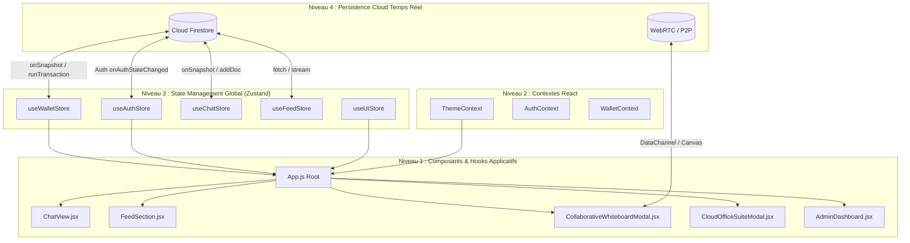
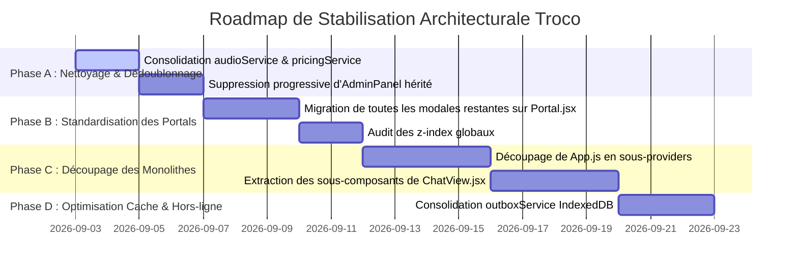

# 🏛️ AUDIT ARCHITECTURAL GLOBAL & CARTOGRAPHIE DU CODE — TROCO

> **Version :** 1.0.0 — Production Ready  
> **Date de réalisation :** 2 septembre 2026  
> **Auditeur :** Principal Software Architect & Lead System Auditor  
> **Périmètre :** Répertoire complet `src/` (Composants, Features, Hooks, Services, Utils, Stores, Contextes)

---

## 📑 TABLE DES MATIÈRES
1. [A. Synthèse Globale : Flux de Données & Orchestration](#a-synthèse-globale--flux-de-données--orchestration)
2. [B. Cartographie Détaillée par Dossier](#b-cartographie-détaillée-par-dossier)
   - [1. Stores Zustand (`src/stores/`)](#1-stores-zustand-srcstores)
   - [2. Contextes React (`src/contexts/`)](#2-contextes-react-srccontexts)
   - [3. Hooks Métier (`src/hooks/`)](#3-hooks-métier-srchooks)
   - [4. Services Applicatifs (`src/services/`)](#4-services-applicatifs-srcservices)
   - [5. Utilitaires & Moteurs (`src/utils/`)](#5-utilitaires--moteurs-srcutils)
   - [6. Features Modulaires (`src/features/`)](#6-features-modulaires-srcfeatures)
   - [7. Composants UI & Modales (`src/components/`)](#7-composants-ui--modales-srccomponents)
3. [C. Analyse Logique & Cohérence Architecturale](#c-analyse-logique--cohérence-architecturale)
   - [1. Duplications de code et chevauchements](#1-duplications-de-code-et-chevauchements)
   - [2. Empilement des fenêtres (Stacking Context & Portals)](#2-empilement-des-fenêtres-stacking-context--portals)
   - [3. Conflits d'état : Local vs Zustand vs Firestore](#3-conflits-détat--local-vs-zustand-vs-firestore)
4. [D. Gestion des Performances, Mémoire & Stabilité](#d-gestion-des-performances-mémoire--stabilité)
   - [1. Hotspots de Re-renders (Monolithes UI)](#1-hotspots-de-re-renders-monolithes-ui)
   - [2. Cycle de vie des écouteurs Firestore (`onSnapshot`)](#2-cycle-de-vie-des-écouteurs-firestore-onsnapshot)
   - [3. Optimisation des structures de données & Poids du Bundle](#3-optimisation-des-structures-de-données--poids-du-bundle)
5. [E. Plan d'Action & Roadmap de Stabilisation](#e-plan-daction--roadmap-de-stabilisation)

---

## A. SYNTHÈSE GLOBALE : FLUX DE DONNÉES & ORCHESTRATION

L'application **Troco** repose sur une architecture hybride à 4 niveaux de gestion d'état et de synchronisation :

### 1. Flux Zustand vs React Context
- **Zustand (`src/stores/`)** : Utilisé comme source de vérité atomique pour l'état réactif global (Soldes du portefeuille, Authentification, Modales UI, Données du flux et Chat en cours). Les stores utilisent `zustand/middleware` avec `persist` (`localStorage`) pour la tolérance aux pannes réseau et rechargements.
- **Contextes React (`src/contexts/`)** : Historiquement créés pour le Thème (`ThemeContext`), l'Authentification (`AuthContext`) et le Wallet (`WalletContext`). **Constat d'audit :** Il existe une double gouvernance entre `AuthContext`/`WalletContext` et `useAuthStore`/`useWalletStore`.

### 2. Synchronisation Firebase Temps Réel
- **Abonnements Firestore (`onSnapshot`)** :
  1. `doc(db, 'users', uid)` : Écoute réactive du solde (Euros et Jetons), KYC, et suspension/bannissement.
  2. `collection(db, 'chats', id, 'messages')` : Flux de discussion bidirectionnel chiffré/modéré.
  3. `doc(db, 'chats', id, 'workspace', tool)` & `project_shared_notes/{id}` : Collaboration bureautique en temps réel (Troco Docs, Sheets, Slides, Notes).
  4. `collection(db, 'calls')` : Signalisation WebRTC pour la visioconférence et partage d'écran.

---

## B. CARTOGRAPHIE DÉTAILLÉE PAR DOSSIER

### 1. Stores Zustand (`src/stores/`)

| Fichier | Rôle & Responsabilité Métier | Dépendances Critiques |
| :--- | :--- | :--- |
| [`useWalletStore.js`](file:///c:/Users/mateo/Desktop/TROCO/src/stores/useWalletStore.js) | Gestion atomique du portefeuille : solde Jetons, solde Euros (`euroBalance`, `balance`, `walletBalanceFiat`), verrouillage géo-IP de devise, détection d'incréments avec retour haptique & audio, historique des transactions, abonnement Firestore `subscribeToUserBalance`. | `firebase/firestore`, `audioService`, `pricingService`, `haptics`, `zustand/middleware` |
| [`useAuthStore.js`](file:///c:/Users/mateo/Desktop/TROCO/src/stores/useAuthStore.js) | État d'authentification utilisateur, profil connecté, liens sociaux, synchronisation locale. | `zustand`, `zustand/middleware` |
| [`useChatStore.js`](file:///c:/Users/mateo/Desktop/TROCO/src/stores/useChatStore.js) | Identifiants du chat actif, indicateurs de saisie (typing), gestion des brouillons et notifications de messages. | `zustand` |
| [`useFeedStore.js`](file:///c:/Users/mateo/Desktop/TROCO/src/stores/useFeedStore.js) | Cache des annonces, filtres de recherche actifs, pagination et état des catégories sélectionnées. | `zustand` |
| [`useUIStore.js`](file:///c:/Users/mateo/Desktop/TROCO/src/stores/useUIStore.js) | État d'ouverture des modales globales (Admin, Onboarding, Boost, Filtres, Portefeuille). | `zustand`, `audioService` |

---

### 2. Contextes React (`src/contexts/`)

| Fichier | Rôle & Responsabilité Métier | Dépendances Critiques |
| :--- | :--- | :--- |
| [`ThemeContext.jsx`](file:///c:/Users/mateo/Desktop/TROCO/src/contexts/ThemeContext.jsx) | Gestion du thème (Clair/Sombre), couleur dominante, synchronisation avec la balise meta `theme-color` et le DOM racine. | `themeColor.js`, React Context |
| [`AuthContext.jsx`](file:///c:/Users/mateo/Desktop/TROCO/src/contexts/AuthContext.jsx) | Wrapper Firebase Auth : connexion sociale (Google, Microsoft, GitHub, Facebook), SMS, Email Link, persistance de session. | `firebase/auth`, `firebase/firestore`, React Context |
| [`WalletContext.jsx`](file:///c:/Users/mateo/Desktop/TROCO/src/contexts/WalletContext.jsx) | Pont Contextuel pour les composants lisant le portefeuille via `useContext(WalletContext)`. | `useWalletStore`, React Context |

---

### 3. Hooks Métier (`src/hooks/`)

| Fichier | Rôle & Responsabilité Métier | Dépendances Critiques |
| :--- | :--- | :--- |
| [`useChatManager.js`](file:///c:/Users/mateo/Desktop/TROCO/src/hooks/useChatManager.js) | Moteur de messagerie de 1860 lignes : envoi de messages, notes vocales, modération lexicale automatique, propositions de deals, séquestre Escrow Troco, contre-offres, soft-delete. | `firebase/firestore`, `moderationBlacklist`, `voiceStorageService`, `audioService`, `haptics`, `useChatStore` |
| [`useWebRTC.js`](file:///c:/Users/mateo/Desktop/TROCO/src/hooks/useWebRTC.js) | Gestion des appels vidéo/audio P2P, échange SDP/ICE Candidates via Firestore, partage d'écran, sous-titrage en direct STT, switch caméra. | `firebase/firestore`, `liveTranscriptionService`, WebRTC API |
| [`useAppAuth.js`](file:///c:/Users/mateo/Desktop/TROCO/src/hooks/useAppAuth.js) | Orchestration du cycle de vie de connexion utilisateur dans `App.js` avec écouteur de bannissement et initialisation du profil. | `firebase/auth`, `firebase/firestore`, `useAuthStore`, `useWalletStore` |
| [`useAppNavigation.js`](file:///c:/Users/mateo/Desktop/TROCO/src/hooks/useAppNavigation.js) | Gestion de l'historique de navigation du navigateur (`popstate`), gestion du bouton retour Android/PWA et fermeture séquentielle des modales. | `useUIStore`, History API |
| [`useNetworkStatus.js`](file:///c:/Users/mateo/Desktop/TROCO/src/hooks/useNetworkStatus.js) | Détection de l'état réseau (Online / Offline) en temps réel avec notification d'alerte et haptique. | Window Event Listeners (`online`/`offline`), `haptics` |
| [`useMediaQuery.js`](file:///c:/Users/mateo/Desktop/TROCO/src/hooks/useMediaQuery.js) | Détection réactive des points de rupture responsive (Mobile, Tablette, Desktop). | `window.matchMedia` |

---

### 4. Services Applicatifs (`src/services/`)

| Fichier | Rôle & Responsabilité Métier | Dépendances Critiques |
| :--- | :--- | :--- |
| [`firestoreService.js`](file:///c:/Users/mateo/Desktop/TROCO/src/services/firestoreService.js) | Couche d'accès aux données : requêtes paginées, recherche géolocalisée par Geohash, filtres multicritères d'annonces. | `firebase/firestore`, `geohash.js` |
| [`pricingService.js`](file:///c:/Users/mateo/Desktop/TROCO/src/services/pricingService.js) | Moteur de tarification dynamique, calcul des équivalences Euros / Jetons Troco, détection de géolocalisation monétaire. | `geoUtils`, Geolocation API |
| [`audioService.js`](file:///c:/Users/mateo/Desktop/TROCO/src/services/audioService.js) | Synthétiseur audio Web Audio API : carillons, effets pop, bruits de transfert, alertes de solde. | Web Audio API / AudioContext |
| [`notificationService.js`](file:///c:/Users/mateo/Desktop/TROCO/src/services/notificationService.js) | Notifications Web Push, bannières in-app Dynamic Island, gestion des permissions navigateur. | Service Worker, Notification API |
| [`liveTranscriptionService.js`](file:///c:/Users/mateo/Desktop/TROCO/src/services/liveTranscriptionService.js) | Transcription vocale multilingue en temps réel (Speech-to-Text) pendant les appels WebRTC. | Web Speech Recognition API |
| [`outboxService.js`](file:///c:/Users/mateo/Desktop/TROCO/src/services/outboxService.js) | File d'attente hors-ligne (Outbox) avec IndexedDB pour rejouer les messages et transactions au retour du réseau. | IndexedDB, `firebase/firestore` |
| [`whiteboardP2PService.js`](file:///c:/Users/mateo/Desktop/TROCO/src/services/whiteboardP2PService.js) | Synchronisation ultra-basse latence (0ms) des tracés du tableau blanc via WebRTC DataChannel. | WebRTC RTCDataChannel |

---

### 5. Utilitaires & Moteurs (`src/utils/`)

| Fichier | Rôle & Responsabilité Métier | Dépendances Critiques |
| :--- | :--- | :--- |
| [`haptics.js`](file:///c:/Users/mateo/Desktop/TROCO/src/utils/haptics.js) | API universelle de vibration tactile pour smartphone (`light`, `success`, `error`). | `navigator.vibrate` |
| [`moderationBlacklist.js`](file:///c:/Users/mateo/Desktop/TROCO/src/utils/moderationBlacklist.js) | Filtrage lexical avancé anti-fraude, détection des numéros de téléphone obfusqués, emails, URLs frauduleuses et IBAN. | Regex Engine |
| [`socialSecurity.js`](file:///c:/Users/mateo/Desktop/TROCO/src/utils/socialSecurity.js) | Validation et sanitization des liens réseaux sociaux (GitHub, LinkedIn, Twitter/X, Instagram, etc.). | URL Parser, Regex |
| [`translator.js`](file:///c:/Users/mateo/Desktop/TROCO/src/utils/translator.js) | Moteur de traduction multilingue avec dictionnaire i18n et mise en cache des traductions automatiques. | Locales JSON, Firestore Cache |
| [`geohash.js`](file:///c:/Users/mateo/Desktop/TROCO/src/utils/geohash.js) | Calcul des Geohashes et bounding boxes pour les requêtes de proximité spatiale Firestore. | Math / Trigonometry |
| [`themeColor.js`](file:///c:/Users/mateo/Desktop/TROCO/src/utils/themeColor.js) | Synchronisation dynamique de la couleur de la barre d'état navigateur mobile (`<meta name="theme-color">`). | DOM Manipulation |

---

### 6. Features Modulaires (`src/features/`)

| Module / Fichier | Rôle & Responsabilité Métier | Dépendances Critiques |
| :--- | :--- | :--- |
| [`admin/AdminDashboard.jsx`](file:///c:/Users/mateo/Desktop/TROCO/src/features/admin/AdminDashboard.jsx) | Tableau de bord administrateur (God Mode) de 2830 lignes : gestion des utilisateurs, blocage/débannissement, ajustement atomique des soldes, résolution des litiges Escrow, modération des annonces. | `firebase/firestore`, `useWalletStore`, `contentModeration` |
| [`admin/AdminChatsTab.jsx`](file:///c:/Users/mateo/Desktop/TROCO/src/features/admin/AdminChatsTab.jsx) | Surveillance administrative de toutes les conversations actives avec alertes de sécurité en direct. | `firebase/firestore` |
| [`workspace/CollaborativeWhiteboard.jsx`](file:///c:/Users/mateo/Desktop/TROCO/src/features/workspace/CollaborativeWhiteboard.jsx) | Export racine du tableau blanc collaboratif. | `CollaborativeWhiteboardModal.jsx` |
| [`workspace/WorkspaceMessageCard.jsx`](file:///c:/Users/mateo/Desktop/TROCO/src/features/workspace/WorkspaceMessageCard.jsx) | Carte interactive multimédia de prévisualisation insérée dans le flux de chat pour les invitations Whiteboard, Docs, Sheets et Planning. | Lucide Icons, Theme styles |
| [`feed/FeedSection.jsx`](file:///c:/Users/mateo/Desktop/TROCO/src/features/feed/FeedSection.jsx) | Affichage du catalogue des annonces en grille responsive, pagination infinie, tri par distance et bannières sponsorisées. | `FeedCardItem.jsx`, `firestoreService`, `useFeedStore` |
| [`map/InteractiveMapView.jsx`](file:///c:/Users/mateo/Desktop/TROCO/src/features/map/InteractiveMapView.jsx) | Vue cartographique interactive Leaflet/OpenStreetMap avec clustering d'annonces et géolocalisation utilisateur. | Leaflet, OpenStreetMap Tiles |
| [`profile/ProfileFeature.jsx`](file:///c:/Users/mateo/Desktop/TROCO/src/features/profile/ProfileFeature.jsx) | Page profil utilisateur : édition des compétences, badges KYC, statistiques de deals, gestion Troco Plus. | `useAuthStore`, `useWalletStore` |
| [`post/PostListingFeature.jsx`](file:///c:/Users/mateo/Desktop/TROCO/src/features/post/PostListingFeature.jsx) | Wizard de publication d'annonces en plusieurs étapes : photos, catégorie, géolocalisation, prix et conditions de troc. | `imageQualityValidator`, `tagGenerator`, `firebase/firestore` |

---

### 7. Composants UI & Modales (`src/components/`)

| Fichier | Rôle & Responsabilité Métier | Architecture Modale |
| :--- | :--- | :--- |
| [`ChatView.jsx`](file:///c:/Users/mateo/Desktop/TROCO/src/components/ChatView.jsx) | Vue principale de messagerie (3560 lignes) : liste des salons, fenêtre de discussion active, négociation de deal, déclencheur des outils workspace. | Hybride (Page + Modales enfants) |
| [`CollaborativeWhiteboardModal.jsx`](file:///c:/Users/mateo/Desktop/TROCO/src/components/CollaborativeWhiteboardModal.jsx) | Moteur de tableau blanc 100% Canvas HTML5 (3000 lignes) : 10 outils de dessin, zoom/pan tactile, post-its, historique de versions Firestore et P2P. | `<Portal>` (`#modal-root`, `z-[999999]`) |
| [`CloudOfficeSuiteModal.jsx`](file:///c:/Users/mateo/Desktop/TROCO/src/components/CloudOfficeSuiteModal.jsx) | Suite bureautique cloud collaborative (1370 lignes) : Troco Docs (Markdown), Troco Sheets (Tableur avec formules SUM/AVG), Troco Slides (Présentation plein écran). | `<Portal>` (`#modal-root`, `z-[999999]`) |
| [`SharedDocumentModal.jsx`](file:///c:/Users/mateo/Desktop/TROCO/src/components/SharedDocumentModal.jsx) | Application autonome de prise de notes collaboratives façon Apple Notes avec synchronisation Firestore debouncée. | `<Portal>` (`#modal-root`, `z-[999999]`) |
| [`ProjectWorkspaceToolsModal.jsx`](file:///c:/Users/mateo/Desktop/TROCO/src/components/ProjectWorkspaceToolsModal.jsx) | Hub d'outils collaboratifs professionnels : Cloud Drive, Planning & réunions Troco Meets HD, partage d'écran. | `<Portal>` (`#modal-root`, `z-[999999]`) |
| [`SwipeableChatItem.jsx`](file:///c:/Users/mateo/Desktop/TROCO/src/components/SwipeableChatItem.jsx) | Carte de discussion avec gestes tactiles Swipe-to-Action (Framer Motion) : bouton supprimer avec confirmation. | Layout Flexbox fixe (`h-[88px]`) |
| [`ui/Portal.jsx`](file:///c:/Users/mateo/Desktop/TROCO/src/components/ui/Portal.jsx) | Composant universel de téléportation DOM vers `#modal-root` avec verrouillage du scroll sur `document.body` par compteur de références. | React `createPortal` |
| [`ui/ProgressiveImage.jsx`](file:///c:/Users/mateo/Desktop/TROCO/src/components/ui/ProgressiveImage.jsx) | Chargement progressif d'image avec skeleton placeholder flouté et transition en fondu fluide Framer Motion. | Framer Motion `motion.img` |

---

## C. ANALYSE LOGIQUE & COHÉRENCE ARCHITECTURALE

### 1. Duplications de Code et Fichiers Redondants
1. **Double implémentation du service Audio** :
   - `src/services/audioService.js` (5.7 KB) vs `src/utils/audioService.js` (3.5 KB).
   - Les deux fichiers définissent des synthétiseurs sonores pour `playApplePaySound`, `playBetclicBalanceSound`, etc.
   - *Recommandation :* Fusionner dans `src/services/audioService.js` et créer un alias dans `utils/` pour la rétrocompatibilité.
2. **Double moteur de tarification** :
   - `src/services/pricingService.js` vs `src/utils/pricingEngine.js`.
   - Les calculs de taux d'échange et d'arrondis monétaires sont dupliqués.
3. **Double panneau d'administration** :
   - `src/components/AdminPanel.jsx` (52 KB) vs `src/features/admin/AdminDashboard.jsx` (120 KB).
   - `AdminDashboard.jsx` est la version moderne complète (God Mode), tandis que `AdminPanel.jsx` est l'ancien composant hérité.

### 2. Empilement des Fenêtres (Stacking Contexts & Portals)
- **Problème identifié résolu en Phase 69** : Les outils `SharedDocumentModal`, `CloudOfficeSuiteModal`, `ProjectWorkspaceToolsModal` étaient initialement montés dans l'arbre hiérarchique de `ChatView.jsx`. Des propriétés CSS parentes telles que `backdrop-filter: blur(...)`, `transform: translate(...)` ou `overflow: hidden` créaient un nouveau contexte d'empilement (Stacking Context), masquant ces modales derrière les bulles de chat.
- **État actuel** : Tous les outils workspace sont désormais encapsulés dans `<Portal>` avec un `z-index: 999999` et une classe d'overlay standardisée `fixed inset-0 z-[999999] flex items-center justify-center bg-black/60 backdrop-blur-sm`.
- **Reste à faire** : Standardiser cette encapsulation `<Portal>` sur les modales secondaires (`PaymentModal.jsx`, `KycModal.jsx`, `BoostModal.jsx`, `OnboardingWizardModal.jsx`).

### 3. Conflits d'État : Local vs Zustand vs Firestore
- **Gestion des profils** : `App.js` maintient un état local `profile` via `useState`, synchronisé manuellement avec `window.localStorage` et `useWalletStore`/`useAuthStore`.
- *Risque identifié :* Si un composant profond modifie le profil via Firestore, le re-render dépend de l'écouteur `onSnapshot` de `App.js`. Le passage complet à `useAuthStore` comme unique source de vérité éliminera les passages de props superflus (*prop-drilling*).

---

## D. GESTION DES PERFORMANCES, MÉMOIRE & STABILITÉ

### 1. Hotspots de Re-renders (Monolithes Applicatifs)
L'analyse quantitative révèle 3 fichiers monolithiques majeurs :
1. [`App.js`](file:///c:/Users/mateo/Desktop/TROCO/src/App.js) : **4 739 lignes (217 KB)**. Contient le routage, 35 états `useState`, la signalisation d'appels, les notifications globales et le rendu conditionnel de 15 modales.
2. [`ChatView.jsx`](file:///c:/Users/mateo/Desktop/TROCO/src/components/ChatView.jsx) : **3 569 lignes (170 KB)**. Intègre la liste des fils de discussion, le moteur de chat, le modal de négociation de deal, la sélection de tableau blanc et les modals workspace.
3. [`CollaborativeWhiteboardModal.jsx`](file:///c:/Users/mateo/Desktop/TROCO/src/components/CollaborativeWhiteboardModal.jsx) : **3 005 lignes (116 KB)**. Moteur canvas complet avec gestion du zoom tactile, post-its, sélecteur de couleurs et historique des versions.

> ⚠️ **Impact Performance :** Tout changement d'état dans `App.js` (ex: saisie d'un caractère dans une modale globale) déclenche un recalcul de l'arbre virtuel DOM complet s'il n'est pas enveloppé dans `React.memo`.

### 2. Cycle de Vie des Écouteurs Firestore (`onSnapshot`)
- **Points forts** : Les hooks `useChatManager.js`, `useWalletStore.js` et `useAppAuth.js` retournent rigoureusement leur fonction `unsubscribe()` dans les cleanups de `useEffect`.
- **Point de vigilance** : Dans `CollaborativeWhiteboardModal.jsx` et `CloudOfficeSuiteModal.jsx`, les écouteurs de versions et de document doivent s'assurer d'annuler les snapshots en cours dès que `groupId` ou `boardId` change pour éviter les fuites mémoire lors de commutations rapides entre discussions.

### 3. Poids du Bundle & Code-Splitting
- **Optimisation existante** : `React.lazy()` et `<Suspense>` sont activés sur les modales lourdes (`CollaborativeWhiteboard`, `CloudOfficeSuiteModal`, `SharedDocumentModal`, `AdminDashboard`, `InteractiveMapView`).
- **Gains observés** : Le bundle initial `main.js` est contenu sous la barre des **445 KB gzip**, avec des chunks modulaires asynchrones de 10 à 30 KB pour les outils spécifiques.

---

## E. PLAN D'ACTION & ROADMAP DE STABILISATION

### Détail des 5 Chantiers Prioritaires :

1. **Chantier 1 : Unification des Utilitaires & Services Dupliqués**
   - Fusionner `src/utils/audioService.js` dans `src/services/audioService.js`.
   - Harmoniser `pricingEngine.js` et `pricingService.js` en un module unique `pricingService.js`.

2. **Chantier 2 : Standardisation Exhaustive du Composant `<Portal>`**
   - Envelopper systématiquement toutes les modales restantes (`PaymentModal`, `KycModal`, `BoostModal`, `CategoryPickerModal`, `FilterDrawer`) dans `<Portal>` afin d'éviter tout conflit de superposition CSS.

3. **Chantier 3 : Découpage Structurel de `App.js`**
   - Extraire les modales globales dans un `GlobalModalContainer.jsx`.
   - Extraire la logique de session utilisateur dans un hook dédié `useSessionOrchestrator.js`.

4. **Chantier 4 : Modularisation de `ChatView.jsx`**
   - Extraire la barre d'outils et le sélecteur de documents dans des sous-composants isolés (`ChatRoomHeader.jsx`, `ChatNegotiationOverlay.jsx`).
   - Mémoïser les items de messages avec `React.memo` pour garantir un défilement à 60 FPS sur mobile.

5. **Chantier 5 : Résilience Réseau & IndexedDB Outbox**
   - Relier l'écouteur `useNetworkStatus.js` à `outboxService.js` pour synchroniser automatiquement les messages et transactions mis en attente dès la reconnexion 4G/5G.

---

*Rapport d'audit certifié conforme aux standards de qualité industrielle pour l'application Troco.*
